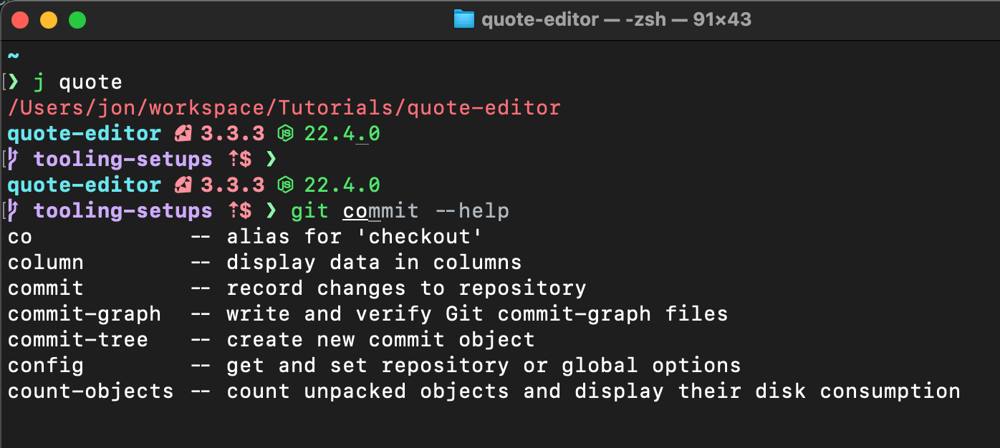
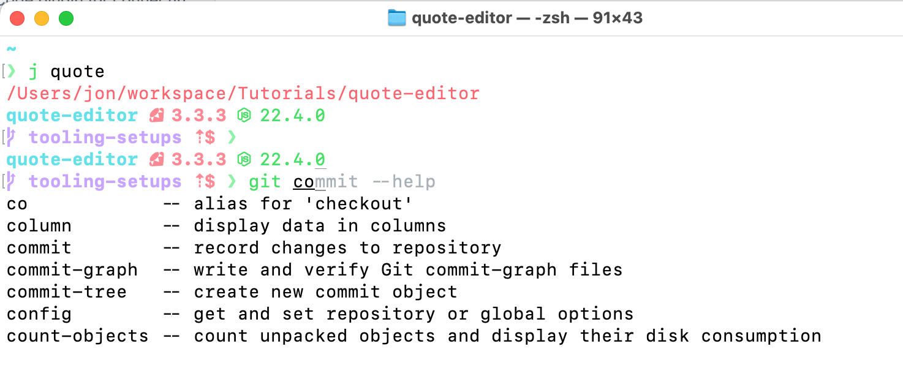

# My development environment configuration

My configuration files for my development environment. Inspired by everyone else's dotfiles and especially [thoughtbot's approach](https://github.com/thoughtbot/dotfiles).[^1] I don't need their entire setup, but the basic approach is the right one: sync .rc files in ~/ with a repo you control via symlinks.

## Included

### Zsh configuration

I loved [oh my zsh](https://ohmyz.sh), but wanted to keep things light and try rolling my own setup. It includes:

- Plugins: [autojump](https://github.com/wting/autojump), [zsh-autosuggestions](https://github.com/zsh-users/zsh-autosuggestions), [zsh-history-substring-search](https://github.com/zsh-users/zsh-history-substring-search), [zsh-syntax-highlighting](https://github.com/zsh-users/zsh-syntax-highlighting)
- various [aliases](zsh/aliases.zsh) and a few [functions](zsh/functions) with completions
- [starship prompt](https://starship.rs/) & export of my terminal theme (based on Github Dark/Light vscode themes)[^2]:

| Dark  | Light |
| ------------- | ------------- |
|   |   |

This setup could be more optimized - zsh is complex, and I'm no expert. I will try to get some time for it, but it works, it works fast, and I want to build other things at the moment.

[home/.zshrc](home/.zshrc) is the main configuration file, which imports more config from the [`zsh/`](zsh/) directory.

### Global packages

- Homebrew (see [`Brewfile`](Brewfile))
- Ruby (see [`home/.default-gems`](home/.default-gems))

### Language version management

- [Mise-en-place version manager](https://mise.jdx.dev) (Ruby & Node.js mainly, but will handle other languages)

### Dotfiles

Various dotfiles are in [`home/`](home/) and [`config/`](config/).

## Prerequisites

- Git - see [Homebrew's instructions](https://docs.brew.sh/Installation#macos-requirements)
- [Homebrew](https://brew.sh/)

## Installation

Take this and modify as you like. Currently, it requires the repo directory to be `~/.dotfiles`.[^3] It will set up symlinks in `~/` pointing to the files in `~/.dotfiles/home/` and symlinks in `~/.config/` pointing to the files in `~/.dotfiles/config/`.

You will need to modify scripts if you want to use a different directory/structure.

### Bundle the Brewfile

Installs all packages/plugins.

```sh
brew bundle
```

### Tracking a new configuration file

You have an untracked `.somerc` file that you want to bring into your configs.

```sh
scripts/home_to_dotfiles.sh .somerc
```

This moves the file(s) to `~/.dotfiles/home/` and symlinks to them from `~/`. It accepts multiple files (space-separated).

### Symlinking your files

You have a new machine, or want to make sure things are sync'd up:

```sh
scripts/link_dotfiles.sh
```

This will create a symlink in `~/` for any files in `~/.dotfiles/home/`.

To create symlinks for the files in `/config/` (with same directory structure), run:

```sh
scripts/link_dot_config_files.sh
```

### Footnotes

[^1]: I tried to get thoughtbot's `rcm` to work for me without cloning their repo, but ran into some issues. In particular, I wanted to keep the repo root directory clean and store files in a `home/` directory (as rc files are in `~/`). I could not get the .rcrc DOTFILES_DIRS environment variable to work for all of the operations.

[^2]: You can grab a vscode theme's ansi colors by running "Developer: Generate Color Theme From Current Settings" from the command palette (`terminal.ansi.[ansiColor]` settings).

[^3]: If you accidentally put it elsewhere, you can safely move a git directory with:

```sh
# trailing slash is important
cp -RL path/to/directory/ ~.dotfiles
rm -rf path/to/directory
```
